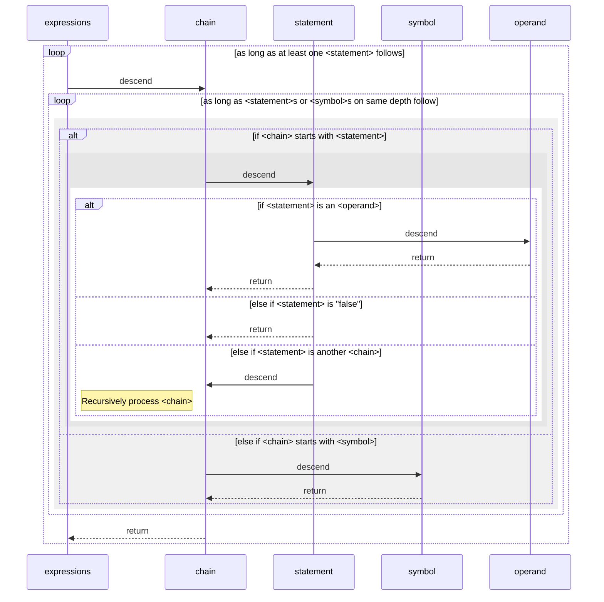

### [prove] syntax

| $\langle$`expressions`$\rangle$ | $\Big\{$ $\langle$`chain`$\rangle$ $\Big\}$                  |
| :------------------------------ | :----------------------------------------------------------- |
| $\langle$`chain`$\rangle$       | $\bigg\{\Big(\langle$`statement`$\rangle\Big|\langle$`symbol`$\rangle\Big)\bigg\}$ $\langle$`statement`$\rangle$$\bigg\{\Big(\langle$`statement`$\rangle\Big|\langle$`symbol`$\rangle\Big)\bigg\}$ |
| $\langle$`statement`$\rangle$   | "["$\Big(\langle$`operand`$\rangle\Big|\langle$`chain`$\rangle\Big|$"false"$\Big)$"]" |
| $\langle$`symbol`$\rangle$      | ":"$\Big|$"\\"$\big($"a"$|\dots|$"z"$|$"A"$|\dots|$"Z"$\big)\Big\{\big($"a"$|\dots|$"z"$|$"A"$|\dots|$"Z"$|$"0"$|\dots|$"9"$|$"_"$\big)\Big\}$ |
| $\langle$`operand`$\rangle$     | $\langle$`number`$\rangle \Big| \big($"a"$|\dots|$"z"$|$"A"$|\dots|$"Z"$\big)\Big\{\big($"a"$|\dots|$"z"$|$"A"$|\dots|$"Z"$|$"0"$|\dots|$"9"$|$"_"$\big)\Big\}$ |
| $\langle$`number`$\rangle$      | $\big($"0"$|\dots|$"9"$\big)\Big\{\big($"0"$|\dots|$"9"$\big)\Big\}$ |

 $|$ 			indicates OR			      	  $\big(\dots\big)$ 			indicate requirement

$\Big[\dots\Big]$ 	indicate optionality			$\Big\{\dots\Big\}$			indicate zero or more repetitions

Spaces between tokens are ignored.

